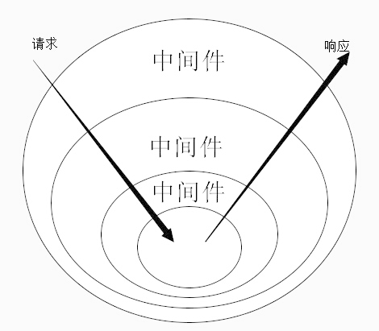

### Node基础第三讲

#### 数据持久化（mysql）

安装

> npm i mysql 2

```javascript
(async () => {
    const db = require('mysql2/promise')
    // 连接配置
    const cfg = {
        host: '127.0.0.1',
        user: 'root',
        password: '123456',
        database: 'user'
    }
    // 建立链接
    const conn = await db.createConnection(cfg).catch((err) => {
        console.log(err);
    });
    
    // 查询
    const sql = 'select * from user;'
    const [rows] = await conn.execute(sql1);
})()
```

#### Koa

- 概述：Koa 是⼀个新的 web 框架， 致力于成为 web 应⽤和 API 开发领域中的⼀个更小、更富有
  表现力、更健壮的基石。

koa是Express的下⼀代基于Node.js的web框架
koa2完全使用Promise并配合 async 来实现异步

- 特点：

  轻量，无捆绑
  优雅的API设计

  中间件架构

- 安装： npm i koa -S

```javascript
const Koa = require('koa');
const app = new Koa();

app.use((ctx) => {
   ctx.body = {
    name: 'tim'
   }
});
app.listen(3000);
```

Koa中间件机制：Koa中间件机制就是函数式 组合概念 Compose的概念，将⼀组需要顺序执行的
函数复合为⼀个函数，外层函数的参数实际是内层函数的返回值。洋葱圈模型可以形象表示这种机
制，是源码中的精髓和难点。



